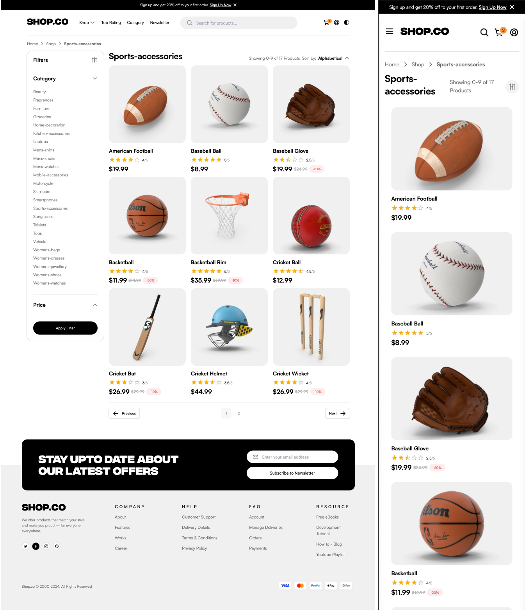
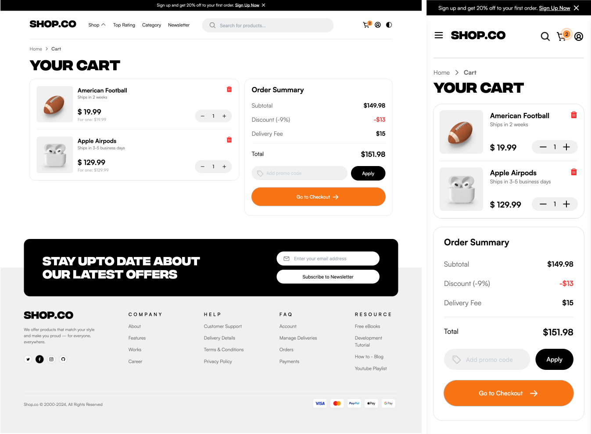

# Shop.co

Welcome to my project **Shop.co**! The project was created based on a free layout from Figma: [E-commerce Website Template (Freebie)](https://www.figma.com/community/file/1273571982885059508/e-commerce-website-template-freebie). The goal of this project is to practice working with modern frontend and backend tools.

## Features

- **Responsiveness**: The app adjusts to different screen sizes.
- **State Management**: **Redux Toolkit** is used for global state management.
- **Product Search**: Users have access to a product search function.
- **Product Catalog**:
  - The app displays products with their images, descriptions, prices, and categories.
  - **Filtering** and **sorting** products (e.g., by price, category) features are available.
- **Shopping Cart** – Users can use all the functionalities of the shopping cart.
- **User Management**: Adding and storing users in the database.
- **User Authentication**: After logging in, users can add products to the cart and place an order.
- **Checkout Process** – Users go through the entire shopping process.
- **User Panel** – Users have access to their account information, as well as their purchase history.
- **Theme Support**: Users can switch between **light** and **dark** themes.

## Screenshots

### Main View


### Main View - Dark


### Main View - Products



### Shopping Cart



### Database Schema (to be expanded in the future)


## Technology

The project was built using the following technologies:

### FRONTEND:

- **React**: A JavaScript framework for building user interfaces.
- **React-Router**: A library for managing routes in a React application.
- **React Hook Form**: A tool for handling forms in React.
- **TanStack Query**: A tool for managing data from APIs.
- **TypeScript**: A superset of JavaScript that provides static typing, improving the reliability and stability of the app.
- **TailwindCSS**: A modern CSS framework.
- **Vite**: A modern build tool for frontend applications.
- **Redux Toolkit**: A library for global state management.
- **Material-UI (MUI)**: A CSS framework for styling components.
- **Zod**: A data validation library.
- **DummyJSON**: An external API that provides product data such as descriptions, prices, images, and categories (documentation: [https://dummyjson.com/docs](https://dummyjson.com/docs)).
- **REST API**: Data is handled through API endpoints.
- **Vitest** and **React Testing Library**: Tools for unit testing.

### BACKEND:

- **Node.js/Express.js**: A platform and framework used for creating the server and backend logic.
- **MySQL**: A relational database used for storing data.
- **JWT (JSON Web Tokens)**: A technology used for user authentication.
- **CORS**: Middleware that enables resource sharing between different domains.
- **bcryptjs**: A library for securely hashing user passwords before storing them in the database.
- **Docker**: A containerization tool that allows easy deployment and management of the app in isolated environments.
- **Postman**: A tool for testing and documenting APIs. Test collection files and environments are located in the `postman/` directory.

The project is set up to run in Docker containers, which ensures seamless integration between the frontend and backend, and maintains consistency across environments.

## Installation

To install the project, follow the steps below:

1. **Clone the repository:**
   Fork the repository to your GitHub account, and then clone it locally.
   ```sh
   git clone https://github.com/ozematt/Shop.co_fullstack.git
   ```
   
2. **Navigate to the project directory:**
   ```sh
   cd Shop.co_fullstack
   ```
   
3. **Build and run the containers:**
   Make sure Docker is installed and running. Then, run the following command.
   ```sh
   docker-compose up --build
   ```

5. **Access the app:**
   - **Frontend**: http://localhost:5173/
   - **Backend**: http://localhost:3005/


## Testing the API using Postman
   You need to have Postman installed.

To import the tests:
1. Open Postmana.
2. Select `Import`.
3. Point to the file `postman/api-tests.postman_collection.json`.
4. Import the environment `postman/local-environment.postman_environment.json`.

## Features in progress

- **Database**: Expanding the database.

Thank you for visiting the repository! 😊
